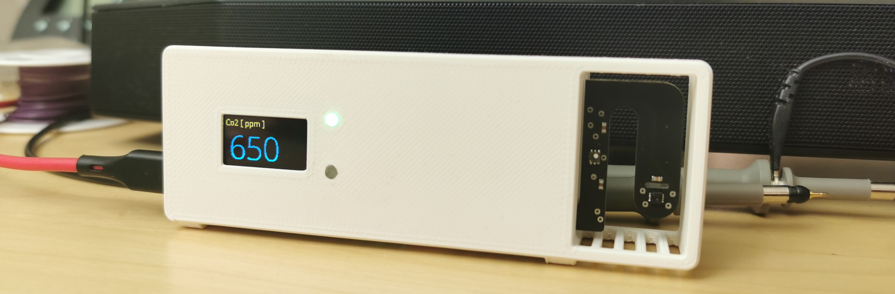

# Wirela Air
Air quality device for CO2, VOC and temperature / humidity. Display and LED indicator for the measured values.

It is about measuring the indoor air. if there are many people in a room, the carbon dioxide content in the air increases. in 2020, the average carbon dioxide (Co2) content was 416.21 ppm. as new buildings are being built better and better and are becoming more and more heat-insulated and air-tight, our human output of Co2 in the air we breathe of up to 40,000 ppm always remains the same. this means that more active ventilation is required. who hasn't experienced this? Your friend wants to ventilate, but you don't? with a Co2 measuring device, clear limits can be defined when ventilation is necessary. if the Co2 value rises above 1000 ppm, ventilation should take place at the latest at 1200 ppm. The room air sensor Wirela Air has a built-in LED to indicate whether ventilation is necessary. if the LED is green, the air is good, <800 ppm, the LED is orange (>800ppm <1200ppm) should be ventilated. if the LED is red (>1200 ppm) must be ventilated. If the CO2 content in the air rises to more than 5000 ppm, a warning tone sounds and urgent ventilation is required. Co2 values >5000ppm can lead to fainting. 

In addition, it is planned that the VOC (volatile organic compounds) value of the air is measured. the VOC value is heard with various cleaning agents or among other things ethanol.




# Overview
Wirela Air is based on a Raspberry Pi Zero and the following components are soldered on a board.
* Sensirion SCD30
* Sensirion SHT30
* Sensirion SGP40
* OLED Display 128x64 0.96'' (SSD1306)
* 2 x Dotsar LED
* Buzzer (GPIO 21)
* Button 1 (+) (GPIO 19)
* Button 2 (-) (GPIO 26)
* USB - C input.


# installation
* Take the micro SD card and insert it into your card reader on the PC
* write the micro SD card with the newest Raspberry Pi OS Lite
* Take the micro SD card out of the card reader and put it again into the PC.
* a drive appears. there you create a file one extension with the name SSH.
* to continue the installation you have to connect the raspberry pi to the network/internet. 
  to do this you create a file called wpa_supplicant.conf on the pc. you only have to enter your SSID (W-LAN Name) and the psk (Password) instead of the xxxxx. note that the " at the end and at the end remain
  in this file you write the following commands:
````
country=CH
ctrl_interface=DIR=/var/run/wpa_supplicant GROUP=netdev
update_config=1

network={
       ssid="xxxxx"
       psk="xxxxx"
       key_mgmt=WPA-PSK
}
````

* Save the file and load the file in the same drive as you have already loaded the SSH file.

* take the microSD card and put it into the Raspberry PI

* take a USB power supply with at least 1.5A output power and connect Wirela_Air.

* wait about 3 minutes and search your network with e.g. "Advanced IP Scanner" for the hostname "raspberry".

* remember the IP address and create a SSH connection with the software "Mobaxterm" user is pi and the password is raspberry

* install git on the raspberry pi with the command.

````
yes | sudo apt update
yes | sudo apt install git
````


* then the process will take about 15 minutes and must be confirmed with Y again and again: 

````
cd /home/pi/
sudo git clone https://github.com/itsnils/Wirela_Air.git
sudo chmod +x /home/pi/Wirela_Air/wirela_installer.sh
/home/pi/Wirela_Air/wirela_installer.sh
````

* after that we have to enable SPI and I2c for the raspberry Pi to communicate with the sensors/display and the LEDs.
````
sudo raspi-config
````
Then with the arrow keys to point 3.
and enable P4 SPI and P5 i2c

* then exit raspi-config and reboot the system
````
sudo reboot
````
* now you have to login again with SSH to the Raspberry Pi.
````
sudo pigpiod
````
* To test the software, we must first disable the watchdog. To do this, you must run the following command.

````
sudo nano /home/pi/Wirela_Air_Settings/wirela_air_settings.txt
````

* now you have to search for "hardware_watchdog".
there should be the default: "True"
change this to "False" and save the file.

* now you can test the software by running the following command.
````
sudo python3 /home/pi/Wirela_Air/main.py
````


* now you should see something on the screen.


* let the program run >2min and check if the screen changes every 5 seconds and new readings are displayed.

* now we need to turn on the hardware watchdog again.
````
sudo nano /home/pi/Wirela_Air_Settings/wirela_air_settings.txt
````

now you have to search for "hardware_watchdog".
change this to "True" and save the file.

* ok great now we have to set that when the Raspberry Pi restarts the program will be executed automatically.

* to do this enter complete command.
````
sudo nano /etc/rc.local
````

* Now add the following statement to the content of the file. This must be inserted before the existing "exit 0" at the end of the file and must contain the path to the existing script.
````
sudo pigpiod
sudo python3 /home/pi/Wirela_Air/main.py &
````
* The statement is completed with a "&" character, this is important insofar, because should your program not only run once, but run in a loop in the background, the Raspberry Pi would possibly get stuck in an infinite loop without "&" and not boot completely.

* now you can save the file with Control + X. and confirm with y.

* then execute the command :
````
sudo reboot
````
you have it business!!
now after you have plugged in the power (>2 minutes)
the first measured values should be shown on the display.
unfortunately it is not possible to turn on the display from begin and show that the system is booting up.


# Software update

* to update the software execute the following commands.
````
cd /home/pi/
sudo rm -r /home/pi/Wirela_Air
sudo git clone https://github.com/itsnils/Wirela_Air.git
````

Now everything is updated.
* To test the software, we must first disable the watchdog. To do this, you must run the following command.

````
sudo nano /home/pi/Wirela_Air_Settings/wirela_air_settings.txt
````

* now you have to search for "hardware_watchdog".
there should be the default: "True"
change this to "False" and save the file.

* now you can test the software by running the following command.
````
sudo python3 /home/pi/Wirela_Air/main.py
````

* After about 5 seconds, the display should show something.

* Test the software for about 2 minutes. does the screen change? and are new readings displayed?
* now we need to turn on the hardware watchdog again.
````
sudo nano /home/pi/Wirela_Air_Settings/wirela_air_settings.txt
````

* now you have to search for "hardware_watchdog".
* change this to "True" and save the file.

* now you can restart the Raspberry Pi
````
sudo reboot
````

